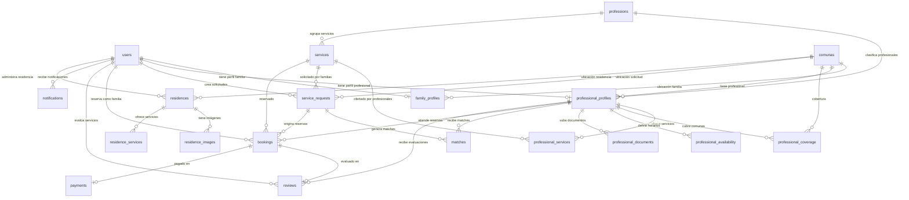

# Base de Datos - Geras App

## Diagrama de Relaciones (Mermaid)

---

## Descripción de Tablas

### Identidad y Perfiles

#### `users`
Tabla central de identidad. Cada registro se crea desde el webhook de Clerk al registrarse un usuario. Contiene el `clerk_id` que vincula la autenticación externa con el sistema interno.

| Columna | Tipo | Descripción |
|---|---|---|
| `id` | UUID (PK) | Identificador interno |
| `clerk_id` | TEXT (UNIQUE) | ID de Clerk para vincular autenticación |
| `email` | TEXT (UNIQUE) | Correo electrónico del usuario |
| `phone` | TEXT | Teléfono de contacto |
| `role` | user_role | Rol en la plataforma |
| `active` | BOOLEAN | Si la cuenta está activa |
| `created_at` | TIMESTAMPTZ | Fecha de creación |
| `updated_at` | TIMESTAMPTZ | Última actualización (trigger automático) |

#### `family_profiles`
Perfil extendido de una familia que busca servicios sociosanitarios para un adulto mayor. Relación 1:1 con `users`.

| Columna | Tipo | Descripción |
|---|---|---|
| `id` | UUID (PK) | Identificador del perfil |
| `user_id` | UUID (FK → users, UNIQUE) | Usuario dueño |
| `full_name` | TEXT | Nombre completo del familiar |
| `comuna_id` | INTEGER (FK → comunas) | Comuna de residencia |
| `phone` | TEXT | Teléfono de contacto |
| `relationship_to_elder` | TEXT | Relación con el adulto mayor (hijo/a, nieto/a, etc.) |
| `notes` | TEXT | Notas adicionales sobre el adulto mayor |

#### `professional_profiles`
Perfil de un profesional sociosanitario. Incluye estado de verificación, rating promedio y experiencia. Relación 1:1 con `users`.

| Columna | Tipo | Descripción |
|---|---|---|
| `id` | UUID (PK) | Identificador del perfil profesional |
| `user_id` | UUID (FK → users, UNIQUE) | Usuario dueño |
| `full_name` | TEXT | Nombre completo |
| `profession_id` | INTEGER (FK → professions) | Profesión principal |
| `bio` | TEXT | Descripción profesional |
| `years_experience` | INTEGER | Años de experiencia |
| `profile_photo_url` | TEXT | URL de foto de perfil |
| `base_comuna_id` | INTEGER (FK → comunas) | Comuna base del profesional |
| `verification_status` | verification_status | Estado de verificación |
| `average_rating` | NUMERIC(3,2) | Rating promedio (1.00-5.00) |
| `total_reviews` | INTEGER | Total de evaluaciones recibidas |
| `active` | BOOLEAN | Si el perfil está activo (visible en búsquedas) |

### Profesional - Detalle

#### `professional_services`
Servicios que un profesional ofrece con precio y modalidad específicos. Un profesional puede ofrecer el mismo servicio en diferentes modalidades.

#### `professional_coverage`
Comunas donde el profesional ofrece sus servicios. Tabla pivote profesional-comuna.

#### `professional_availability`
Bloques horarios semanales del profesional. Define qué días y horas está disponible para atender.

#### `professional_documents`
Documentos de verificación subidos por el profesional. **Tabla sensible** — nunca expuesta a familias. Incluye cédula, antecedentes, títulos, etc.

| Columna | Tipo | Descripción |
|---|---|---|
| `id` | UUID (PK) | Identificador del documento |
| `professional_id` | UUID (FK → professional_profiles) | Profesional dueño |
| `document_type` | document_type | Tipo de documento |
| `file_url` | TEXT | URL del archivo en storage |
| `status` | verification_status | Estado de revisión |
| `reviewed_by` | UUID (FK → users) | Admin que revisó |
| `reviewed_at` | TIMESTAMPTZ | Fecha de revisión |
| `expires_at` | TIMESTAMPTZ | Fecha de expiración del documento |
| `notes` | TEXT | Notas del revisor |

### Solicitudes y Matching

#### `service_requests`
Solicitudes de servicio creadas por familias. Contienen el servicio requerido, comuna, presupuesto y urgencia. El algoritmo de matching genera candidatos a partir de estas solicitudes.

| Columna | Tipo | Descripción |
|---|---|---|
| `id` | UUID (PK) | Identificador de la solicitud |
| `family_user_id` | UUID (FK → users) | Familia que solicita |
| `service_id` | INTEGER (FK → services) | Servicio requerido |
| `comuna_id` | INTEGER (FK → comunas) | Comuna donde se necesita |
| `description` | TEXT | Descripción de la necesidad |
| `urgency_level` | urgency_level | Nivel de urgencia |
| `preferred_date` | DATE | Fecha preferida |
| `frequency` | TEXT | Frecuencia deseada (puntual, semanal, etc.) |
| `budget_min` / `budget_max` | INTEGER | Rango de presupuesto en CLP |
| `gender_pref` | TEXT | Preferencia de género del profesional |
| `status` | request_status | Estado de la solicitud |

#### `matches`
Relación solicitud-profesional generada por el algoritmo de matching. Cada match tiene un score calculado en base a servicio, ubicación, disponibilidad, verificación, rating y experiencia.

### Reservas y Evaluaciones

#### `bookings`
Reservas de servicios confirmadas. Pueden originarse desde una solicitud con match o desde búsqueda directa. Incluye precio acordado y comisión de plataforma.

#### `reviews`
Evaluaciones post-servicio. Inmutables una vez creadas. El trigger `trg_recalculate_rating` actualiza automáticamente el rating promedio del profesional.

### Residencias

#### `residences`
Vitrina de residencias para adultos mayores. Incluye información de contacto, precios, capacidad y estado de verificación. El campo `soma_integrated` indica si la residencia usa el sistema SOMA (gestión interna).

#### `residence_images`
Galería de fotos de cada residencia. Ordenadas por `sort_order`.

#### `residence_services`
Servicios que ofrece una residencia (alimentación, enfermería 24h, actividades, etc.).

### Sistema

#### `payments`
Registro de pagos asociados a bookings. Preparado para integración con pasarela de pagos (etapa 2 de monetización). El campo `platform_fee` registra la comisión de Geras (5-7%).

#### `notifications`
Notificaciones in-app y push. Creadas solo desde el servidor. El campo `metadata` (JSONB) permite adjuntar datos contextuales (ID de booking, nombre del profesional, etc.).

### Catálogos

#### `comunas`
Comunas de Santiago disponibles en el MVP. 20 comunas del sector oriente y centro.

#### `professions`
Catálogo de profesiones sociosanitarias. Define si requiere título profesional, validación de documentos y nivel de riesgo.

#### `services`
Catálogo de servicios por profesión. Incluye precios base de referencia en CLP y duración en minutos.

---

## Enums

| Enum | Valores | Uso |
|---|---|---|
| `user_role` | `family`, `professional`, `residence`, `admin` | Rol del usuario en la plataforma |
| `verification_status` | `pending`, `approved`, `rejected`, `expired` | Estado de verificación de profesionales y documentos |
| `document_type` | `national_id`, `background_check`, `professional_title`, `complementary_cert`, `professional_registry`, `work_reference`, `other` | Tipo de documento subido por profesional |
| `service_modality` | `home_visit`, `online`, `center`, `one_time` | Modalidad de atención del servicio |
| `request_status` | `created`, `reviewing`, `sent_to_professionals`, `professional_interested`, `accepted`, `scheduled`, `completed`, `cancelled`, `evaluated` | Ciclo de vida de una solicitud |
| `match_status` | `suggested`, `viewed`, `contacted`, `accepted`, `rejected` | Estado del match solicitud-profesional |
| `booking_status` | `pending`, `confirmed`, `completed`, `cancelled` | Estado de una reserva |
| `payment_status` | `pending`, `paid`, `refunded`, `failed` | Estado de un pago |
| `urgency_level` | `low`, `medium`, `high` | Urgencia de la solicitud |
| `day_of_week` | `monday` a `sunday` | Días de la semana para disponibilidad |
| `risk_level` | `low`, `medium`, `high` | Nivel de riesgo de una profesión |

---

## Funciones SQL

### `auth_user_id()`

- **Propósito**: Resolver el UUID interno del usuario autenticado a partir del JWT de Clerk
- **Parámetros**: Ninguno
- **Retorno**: `UUID` — El `users.id` del usuario autenticado
- **Ejemplo de uso**: `SELECT auth_user_id();` dentro de una política RLS
- **Seguridad**: `SECURITY DEFINER` — bypasea RLS de la tabla `users` para evitar dependencia circular

### `auth_user_role()`

- **Propósito**: Obtener el rol del usuario autenticado
- **Parámetros**: Ninguno
- **Retorno**: `user_role` — El rol del usuario (`family`, `professional`, `residence`, `admin`)
- **Ejemplo de uso**: `USING (auth_user_role() = 'admin')` en política RLS
- **Seguridad**: `SECURITY DEFINER` — misma razón que `auth_user_id()`

### `generate_matches(request_id UUID)`

- **Propósito**: Generar una lista rankeada de profesionales candidatos para una solicitud de servicio
- **Parámetros**: `request_id UUID` — ID de la solicitud en `service_requests`
- **Retorno**: `TABLE (professional_id UUID, score INTEGER)` — Hasta 10 profesionales con su puntaje
- **Algoritmo de scoring**:
  - +30 pts: Ofrece el servicio solicitado dentro del presupuesto
  - +20 pts: Tiene cobertura en la comuna solicitada
  - +20 pts: Tiene disponibilidad horaria activa
  - +15 pts: Está verificado (approved)
  - +10 pts: Rating promedio >= 4.0
  - +5 pts: 3+ años de experiencia
- **Ejemplo de uso**: `SELECT * FROM generate_matches('uuid-de-solicitud');`
- **Seguridad**: `SECURITY DEFINER` — necesita leer tablas con RLS activo

### `process_request_matches(p_request_id UUID)`

- **Propósito**: Ejecutar el matching completo para una solicitud: generar matches, insertarlos en la tabla y actualizar el estado de la solicitud
- **Parámetros**: `p_request_id UUID` — ID de la solicitud
- **Retorno**: `INTEGER` — Cantidad de matches generados
- **Comportamiento**:
  1. Elimina matches previos con status `suggested` para esa solicitud
  2. Genera nuevos matches vía `generate_matches()`
  3. Inserta los matches (ignora duplicados)
  4. Si hay matches, actualiza el estado de la solicitud a `sent_to_professionals`
- **Ejemplo de uso**: `SELECT process_request_matches('uuid-de-solicitud');`
- **Seguridad**: `SECURITY DEFINER` — necesita insertar en `matches` y actualizar `service_requests`

### `calculate_platform_fee(price INTEGER, fee_pct NUMERIC DEFAULT 0.06)`

- **Propósito**: Calcular la comisión de la plataforma Geras sobre un precio de servicio
- **Parámetros**:
  - `price INTEGER` — Precio del servicio en CLP
  - `fee_pct NUMERIC` — Porcentaje de comisión (default 6%)
- **Retorno**: `INTEGER` — Monto de la comisión redondeado
- **Ejemplo de uso**: `SELECT calculate_platform_fee(35000);` → `2100`
- **Seguridad**: Función pura sin acceso a datos

### `update_updated_at()`

- **Propósito**: Trigger function que actualiza automáticamente el campo `updated_at` al momento actual en cada UPDATE
- **Parámetros**: Ninguno (trigger function)
- **Retorno**: `TRIGGER`
- **Tablas que lo usan**: `users`, `family_profiles`, `professional_profiles`, `professional_documents`, `service_requests`, `matches`, `bookings`, `residences`, `payments`

### `update_professional_rating()`

- **Propósito**: Trigger function que recalcula el rating promedio y total de reviews de un profesional cada vez que se inserta o actualiza una review
- **Parámetros**: Ninguno (trigger function)
- **Retorno**: `TRIGGER`
- **Tabla que dispara**: `reviews` (AFTER INSERT OR UPDATE)

---

## Vistas

### `admin_professionals_view`

- **Propósito**: Vista completa de profesionales para el panel de administración. Incluye datos que no son públicos como email, documentos pendientes y total de documentos.
- **Tablas fuente**: `professional_profiles`, `users`, `professions`, `comunas`, `professional_documents`, `professional_services`, `professional_coverage`
- **Campos destacados**:
  - `pending_documents`: Cantidad de documentos pendientes de revisión
  - `total_documents`: Total de documentos subidos
  - `active_services`: Servicios activos del profesional
  - `coverage_comunas`: Array de nombres de comunas donde opera
- **Uso**: Panel admin → sección de verificación de profesionales

### `public_professionals_view`

- **Propósito**: Vista pública de profesionales para búsqueda de familias. Solo muestra profesionales aprobados y activos. No expone datos sensibles (email, documentos).
- **Filtro**: `WHERE verification_status = 'approved' AND active = TRUE`
- **Campos destacados**:
  - `services`: JSON array con servicios, precios y modalidades
  - `coverage_comunas`: Array de comunas de cobertura
  - `availability`: JSON array con horarios disponibles
- **Uso**: App familia → búsqueda directa de profesionales

### `admin_metrics_view`

- **Propósito**: Dashboard de métricas generales de la plataforma para el panel admin.
- **Métricas**:
  - `total_families`: Total de usuarios familia
  - `total_professionals`: Total de usuarios profesional
  - `verified_professionals`: Profesionales verificados
  - `pending_verification`: Profesionales pendientes de verificación
  - `active_residences`: Residencias activas y verificadas
  - `total_requests` / `completed_requests`: Solicitudes totales y completadas
  - `active_bookings` / `completed_bookings`: Reservas activas y completadas
  - `platform_avg_rating`: Rating promedio de la plataforma

---

## Índices

| Índice | Tabla | Columnas | Justificación |
|---|---|---|---|
| `idx_professional_profiles_verification` | professional_profiles | verification_status | Filtrado rápido en panel admin (pendientes vs aprobados) |
| `idx_professional_profiles_active` | professional_profiles | active | Filtrado de profesionales visibles en búsqueda pública |
| `idx_professional_profiles_profession` | professional_profiles | profession_id | Búsqueda por tipo de profesión |
| `idx_professional_coverage_comuna` | professional_coverage | comuna_id | Búsqueda de profesionales por comuna |
| `idx_professional_availability_day` | professional_availability | professional_id, day_of_week | Consulta de disponibilidad por día |
| `idx_service_requests_status` | service_requests | status | Filtrado de solicitudes por estado |
| `idx_service_requests_familia` | service_requests | family_user_id | Solicitudes de una familia específica |
| `idx_matches_request` | matches | request_id | Matches de una solicitud específica |
| `idx_matches_professional` | matches | professional_id | Matches de un profesional específico |
| `idx_bookings_professional` | bookings | professional_id | Reservas de un profesional |
| `idx_bookings_familia` | bookings | family_user_id | Reservas de una familia |
| `idx_bookings_status` | bookings | status | Filtrado de reservas por estado |
| `idx_residences_comuna` | residences | comuna_id | Búsqueda de residencias por comuna |
| `idx_residences_active` | residences | active, verified | Filtrado de residencias visibles (activas + verificadas) |
| `idx_notifications_user` | notifications | user_id, read | Notificaciones no leídas de un usuario |

---

## Migraciones Aplicadas

| Versión | Nombre | Descripción |
|---|---|---|
| 001 | `001_initial_schema` | Schema completo: tablas, enums, índices, triggers, funciones, datos semilla |
| 002 | `002_rls_policies` | Habilitar RLS en todas las tablas |
| 003 | `003_match_function` | Funciones de matching: `generate_matches` y `process_request_matches` |
| 004 | `004_views` | Vistas: admin_professionals, public_professionals, admin_metrics |
| 005 | `005_rls_helper_functions` | Funciones helper: `auth_user_id()` y `auth_user_role()` |
| 006 | `006_rls_users_profiles` | Políticas RLS: users, family_profiles, professional_profiles, professional_documents |
| 007 | `007_rls_services_requests_matches` | Políticas RLS: professional_services, coverage, availability, service_requests, matches |
| 008 | `008_rls_bookings_reviews_residences_payments_notifications` | Políticas RLS: bookings, reviews, residences, residence_images, residence_services, payments, notifications |
| 009 | `009_rls_catalog_tables` | Políticas RLS: comunas, professions, services (catálogos públicos) |
| 010 | `010_rls_enable_catalog` | Habilitar RLS en tablas de catálogo |
